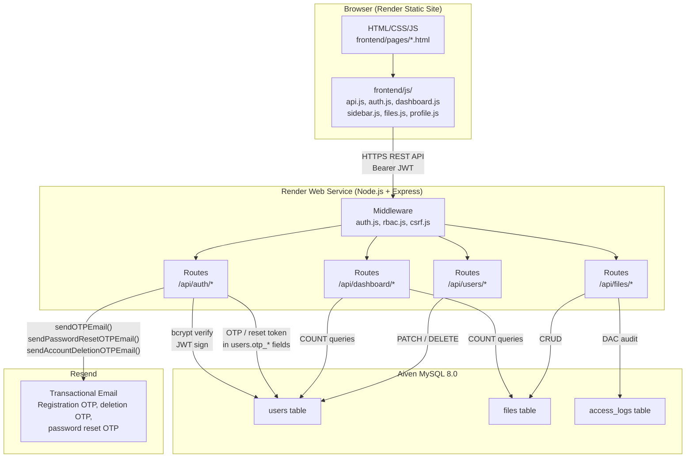
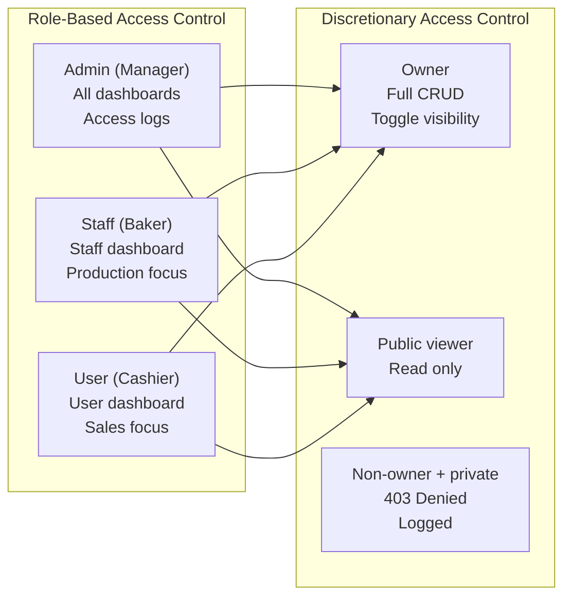
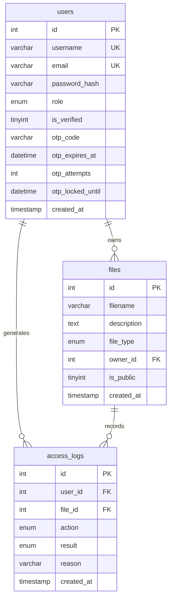

# BakeSync IAS102 System Architecture

## Stack Overview

| Layer    | Technology              |
|----------|-------------------------|
| Frontend | HTML / CSS / JavaScript |
| Backend  | Node.js + Express       |
| Database | MySQL 8.0 (Aiven Cloud) |
| Hosting  | Render (Static + Web Service) |
| Email    | Resend SDK              |
| Auth     | JWT + bcrypt            |

## Frontend UX (IAS102 shell)

Authenticated pages share **`frontend/css/style.css`** and a common layout:

| Area | Contents |
|------|-----------|
| **Topbar** | Mobile hamburger, breadcrumb (`#topbar-breadcrumb`, populated by `renderBreadcrumb()` in `sidebar.js`), **theme toggle** only (`#theme-toggle`). No username, role, or sign-out in the topbar. |
| **Sidebar** | `sidebar.js` renders into `#sidebar`: logo, role-filtered nav, **Settings** link in the nav list, footer user card (avatar, username, role badge), **Sign Out**. |
| **Theme** | `config.js` restores `bakesync_theme` before paint; `dashboard.js` binds the toggle (`applyTheme` / `initThemeToggle`, invoked from `initNavbar()`). Dark palette uses `:root[data-theme="dark"]` in `style.css`. |

See **[FRONTEND.md](./FRONTEND.md)** for page-by-page behavior and API mapping.

## System Architecture Diagram



## Authentication Flow

```mermaid
sequenceDiagram
  participant U as User (Browser)
  participant FE as Frontend
  participant BE as Backend (Express)
  participant DB as MySQL
  participant EM as Resend Email

  Note over U,EM: Registration Flow (MFA)

  U ->> FE: Fill register form
  FE ->> BE: POST /api/auth/register
  BE ->> DB: INSERT user (is_verified=0)
  BE ->> EM: sendOTPEmail(email, otp)
  EM -->> U: Email with 6-digit OTP
  BE -->> FE: 201 { userId, expiresAt }
  FE ->> U: Redirect to otp.html

  U ->> FE: Enter OTP code
  FE ->> BE: POST /api/auth/verify-otp
  BE ->> DB: Check otp_code + expiry + attempts
  BE ->> DB: UPDATE is_verified=1, clear OTP
  BE -->> FE: 200 { message: verified }
  FE ->> U: Redirect to login.html

  Note over U,EM: Login Flow

  U ->> FE: Enter username + password
  FE ->> BE: POST /api/auth/login
  BE ->> DB: SELECT user by username
  BE ->> BE: bcrypt.compare(password, hash)
  BE ->> BE: jwt.sign({ id, role, username })
  BE -->> FE: 200 { token, role, username }
  FE ->> U: Redirect to role dashboard

  Note over U,EM: Password reset (verified accounts only)

  U ->> FE: Forgot password — enter email
  FE ->> BE: POST /api/auth/forgot-password
  BE ->> DB: Store reset OTP in otp_code / otp_expires_at
  BE ->> EM: sendPasswordResetOTPEmail(email, username, otp)
  EM -->> U: Email with 6-digit code
  FE ->> BE: POST /api/auth/verify-reset-otp
  BE -->> FE: { resetToken }
  FE ->> BE: POST /api/auth/reset-password
  BE ->> DB: bcrypt hash; clear reset state
  FE ->> U: Close modal; sign in with new password
```

## Authorization Model



## Database Schema



## File Structure

```
BakeSync/
├── backend/
│   ├── src/
│   │   ├── config/
│   │   │   └── db.js           # MySQL connection pool
│   │   ├── middleware/
│   │   │   ├── auth.js         # JWT verification
│   │   │   ├── rbac.js         # Role checking
│   │   │   └── csrf.js         # Origin validation
│   │   ├── routes/
│   │   │   ├── auth.js         # Register, login, OTP, forgot/reset password
│   │   │   ├── dashboard.js    # Role-specific stats
│   │   │   ├── files.js        # DAC file management
│   │   │   └── users.js        # Profile, deletion
│   │   └── utils/
│   │       ├── otp.js          # OTP generation
│   │       └── mailer.js       # Resend email
│   ├── index.js                # Express app entry
│   └── package.json
├── frontend/
│   ├── pages/
│   │   ├── login.html
│   │   ├── register.html
│   │   ├── otp.html
│   │   ├── dashboard-admin.html
│   │   ├── dashboard-staff.html
│   │   ├── dashboard-user.html
│   │   ├── files.html
│   │   └── profile.html
│   ├── js/
│   │   ├── api.js              # API request wrapper
│   │   ├── auth.js             # Login, register, OTP, forgot-password UI
│   │   ├── config.js           # API base URL
│   │   ├── dashboard.js        # Dashboard loaders
│   │   ├── files.js            # File management
│   │   ├── profile.js          # Profile handlers
│   │   └── sidebar.js          # Navigation
│   └── css/
│       └── style.css
├── database/
│   ├── schema.sql              # Main schema + seed data
│   ├── full_database.sql       # Complete install (same as schema + header)
│   └── migrations/             # Optional SQL (e.g. rollback_* helpers)
└── docs/
    ├── ARCHITECTURE.md         # This file
    ├── DATABASE.md             # Full SQL reference
    ├── FRONTEND.md             # UI pages and JS modules
    └── TECHNICAL_REPORT.md     # Security analysis
```
