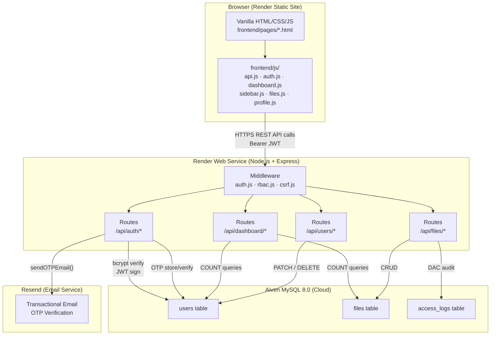
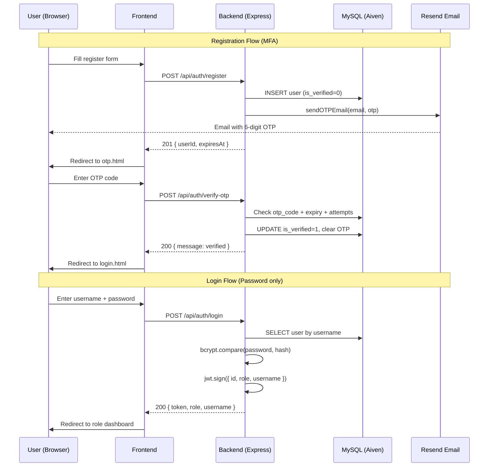
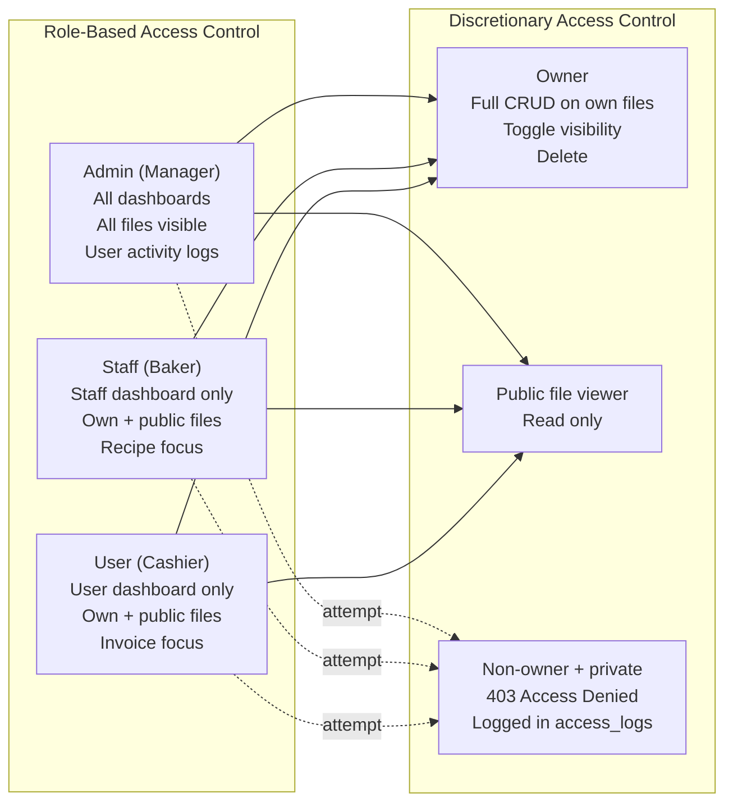
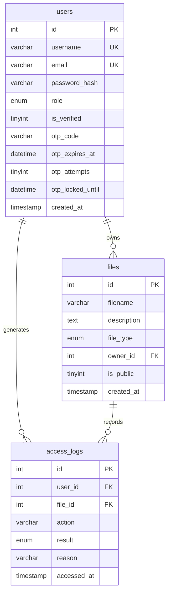
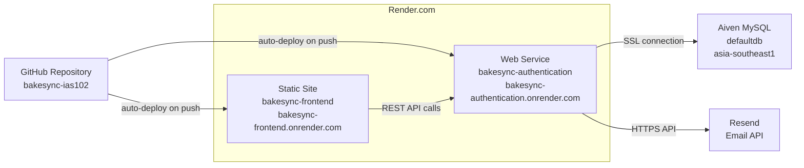

# BakeSync IAS102 — System Architecture

## Stack Overview

| Layer       | Technology                              |
|-------------|------------------------------------------|
| Frontend    | Vanilla HTML / CSS / JavaScript         |
| Backend     | Node.js + Express                       |
| Database    | MySQL 8.0 (Aiven Cloud)                 |
| Hosting FE  | Render Static Site                      |
| Hosting BE  | Render Web Service                      |
| Email       | Resend SDK                              |
| Auth        | JWT (jsonwebtoken) + bcrypt             |

## System Architecture Diagram

## Authentication Flow

## Authorization Model

## Database Schema

## Deployment Architecture

